**UNIVERSIDAD CENTROAMERICANA JOSÉ SIMEÓN CAÑAS** 

**Programación  de**  

**Dispositivos Móviles** 

**Propuesta de Proyecto:**  

Eats Ease 

**Integrantes:** 

Moran Rivas, Xavier Fabricio 00106121 Portan Rivas, Jaime Samuel 00046119 Quesada Cortez,  Daniel Alfredo 00147619 Roque Castro, Cesar Antonio 00015319

**miércoles, 12 de abril de 2023 ![ref1]![ref2]**

![ref3]

![ref4]

Eats Ease ![ref5]![ref6]![ref7]

**“**Organización del tiempo en recetas de comida con ingredientes que poseo**”**  

**Descripción del problema:**  

Existen muchas personas que les resulta difícil preparar comidas diarias y lograr su ingesta de alimentos, como lo son estudiantes y personas del ámbito laboral que poseen tiempo limitado para preparar sus comidas, a menudo no saben ¿qué preparar? ¿Qué les falta a sus recetas? ¿Cuánto tiempo se tarda en cocinar? Como resultado, tienden a perder el tiempo tratando de recordar lo que pueden y no pueden hacer. Además, la mayoría de las aplicaciones de recetas existentes son demasiado complejas para buscar, ya que no saben que posee el usuario para lograr dicha receta.

**Objetivo:** Desarrollar una aplicación móvil de organización de recetas de comida en base a ingredientes que posee el usuario que tenga un promedio de calificación de 4 estrellas o más en la Google Play Store dentro de los primeros seis meses desde su lanzamiento oficial. 

- **Específico:** El objetivo se centra en el lanzamiento de una aplicación móvil para organizar recetas de comida utilizando ingredientes que el usuario tiene a su alcance. 
- **Medible:** El objetivo se puede medir mediante el promedio de calificación en la tienda de aplicación después de los primeros seis meses desde el lanzamiento.
- **Alcanzable:** El objetivo es realista, ya que se basa en una interfaz intuitiva y fácil de usar, así como en la calidad y disponibilidad de las recetas.
- **Relevante:** El objetivo es relevante para la misión de la aplicación, que es ayudar a las personas a organizar sus recetas de comida de manera eficiente y aumentar la productividad con el tiempo.
- **Tiempo:** El objetivo establece un marco de tiempo específico de seis meses después del lanzamiento oficial para alcanzar un promedio de calificación de 4 estrellas o más. 

Con este objetivo SMART en mente, nosotros como la empresa desarrolladora de la aplicación tenemos un objetivo claro y específico para trabajar y medir su progreso. Además, el objetivo proporciona un marco claro para la toma de decisiones estratégicas con respecto al diseño de la interfaz de usuario, la calidad de la redacción y la experiencia ![ref1]![ref2]![ref8]del usuario para garantizar que la aplicación sea fácil de usar y con una alta satisfacción del ![ref9]usuario.** 

**Funcionalidades principales: ![ref5]![ref6]**

- Búsqueda de recetas, función de búsqueda que permite a los usuarios encontrar recetas en función de los ingredientes que tienen en su cocina, el tipo de plato que desean preparar, la dieta que siguen, etc.
- Categorización de recetas, permite a los usuarios guardar y organizar sus recetas de manera eficiente. 
- Organizar sus recetas en Google calendar.
- Compartir recetas, permitir a los usuarios compartir recetas con amigos y familiares por correo electrónico, mensaje de texto o redes sociales.
- Consejos de cocina, ayuda al usuario a mejorar su forma de cocinar y medir los tiempos de cocción, etc.
- Cálculo nutricional de cada receta dada por aplicación.

**Público objetivo:**  

Para todas las personas que necesiten una herramienta eficaz para administrar sus recetas diarias y maximizar su productividad con el tiempo o probar cosas nuevas con los mismos ingredientes que poseen.

Con este planteamiento del problema, el objetivo es desarrollar una aplicación móvil que satisfaga las necesidades de los usuarios y les permita administrar de manera fácil y eficiente sus recetas diarias.

Antecedentes. ![ref5]![ref6]![ref7]![ref4]

Para esta sección hemos decidido mostrar 3 aplicaciones las cuales consideramos que cumplen con las características apropiadas para abordar dicho problema, describiéndolas de una forma detallada. 

La primera de ellas es “spoonacular food companion”, dicha aplicación cuenta con algunas características como, por ejemplo: permite al usuario hacer planes de comidas con recetas, alimentos empacados y comidas de restaurantes, cuenta con seguimiento de nutrición, una lista de compras automáticas y un espacio para almacenar fotos, ubicaciones y notas de sus experiencias. 

La aplicación  fue publicada el 30 de agosto del 2018 y es ofrecida al público por dsky requiriendo una versión de Android 4.4 y posteriores, a la fecha cuenta con más de cinco mil descargas,  esta  aplicación  se  encuentra  actualmente  en  su  versión  1.2.1  y  su  última actualización fue el 5 de septiembre de 2020. 

A continuación, mostramos algunas capturas de pantalla de dicha aplicación:

- **Pantalla de inicio:** muestra un menú interactivo que permite al usuario desplazar las diferentes pantallas en donde podemos observar las características que esta posee.

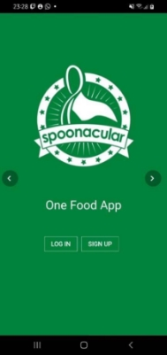 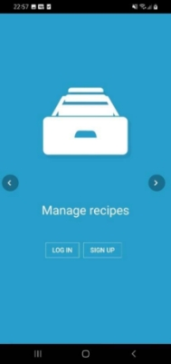 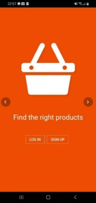

4  ![ref1]![ref2]![ref10]![ref8]![ref9]

Morán, Portan, Quesada, Roque  

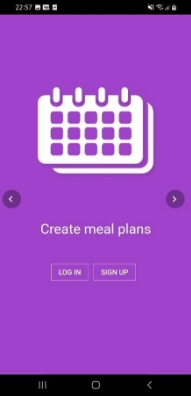 

- “Log in” y “Sing up” 

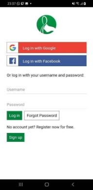 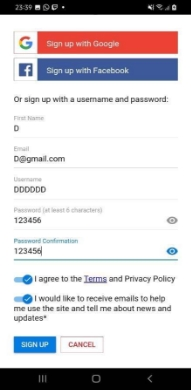

6  ![ref1]![ref2]![ref10]![ref8]![ref9]

Morán, Portan, Quesada, Roque  
![ref11]

![ref4]

- Pantalla principal y barra lateral![ref5]![ref6]![ref7]

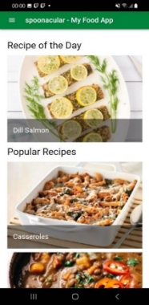 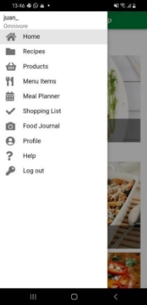

- Sección “Manage recipes” 

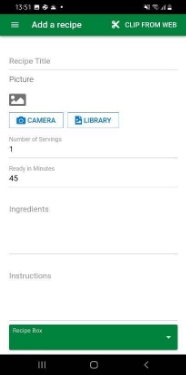 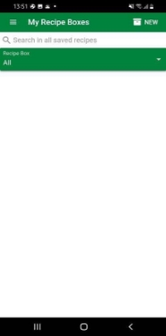

![ref4]

- Sección “Find the right products” ![ref5]![ref6]![ref7]

 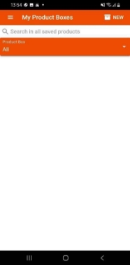

- Sección “Save favorite restaurant meals”

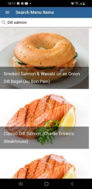 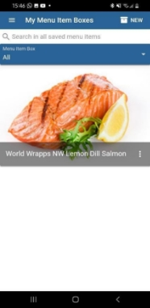

![ref4]

- Sección “Create meal plans”![ref5]![ref6]![ref7]

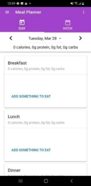 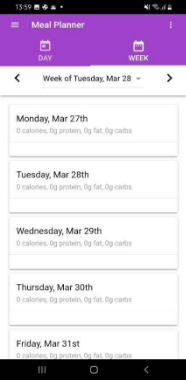

- Sección “Get your shopping list” (Update and Add to list)

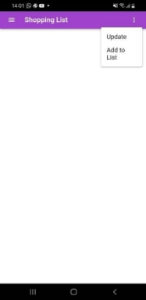 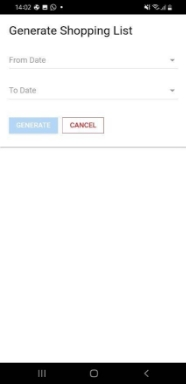 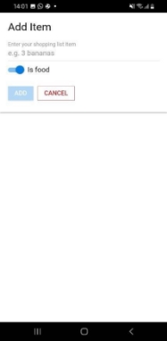

9  ![ref1]![ref2]![ref10]![ref8]![ref9]

Morán, Portan, Quesada, Roque  
![ref11]

![ref4]

- **Información platillo:** dentro de los platillos podemos observar información general ![ref5]![ref6]![ref7]como, por ejemplo: para cuantas personas es el plato, en cuanto tiempo está listo y los gastos. También cuenta con una sección de ingredientes los cuales se utilizarán, los pasos a seguir para poder realizarlo y por último una sección donde muestra la gráfica nutricional. 

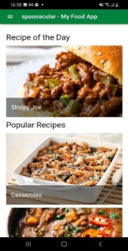 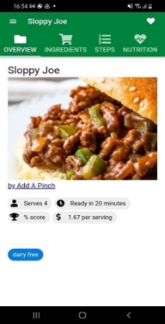 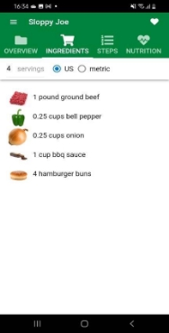

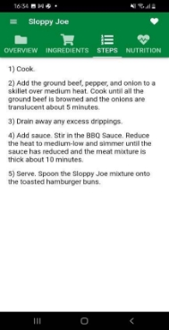 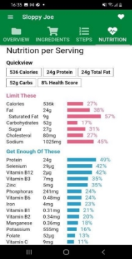

La segunda aplicación que hemos decidido mostrar es “Whisk”, esta aplicación cuenta con ![ref1]![ref2]![ref8]![ref9]algunas características como, por ejemplo: cuenta con una pantalla principal (home), donde ![ref10]

10 

Morán, Portan, Quesada, Roque 
![ref11]

![ref4]

los usuarios pueden realizar publicaciones de sus recetas, también cuenta con una sección ![ref5]![ref6]![ref7]de búsqueda donde los usuarios pueden buscar recetas directamente o aplicar diferente filtro según su preferencia, pueden guardar sus recetas preferidas, planificar su semana y hacer una lista de compras. Y por último cuenta con secciones distintas como por ejemplo un espacio de comunidad, agregar amigos y mi perfil.

Whisk fue publicada el 16 de diciembre del 2019 por whisk.com y requiere de una versión de Android de 7.0 y posteriores, cuenta con más de un millón descargas, esta aplicación se encuentra en su versión 1.68.1 y su última actualización fue el 24 de marzo de 2023.

A continuación, se muestran algunas capturas de pantalla sobre dicha aplicación:

- **Pantalla de inicio:** Muestras las opciones “login” y “Sing up” 

 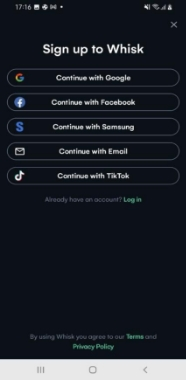 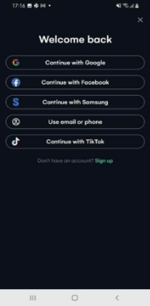

- Pantalla principal (home), búsqueda (explore) y guardar recetas (saved) 

11  ![ref1]![ref2]![ref10]![ref8]![ref9]

Morán, Portan, Quesada, Roque  

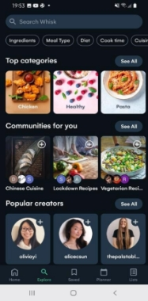 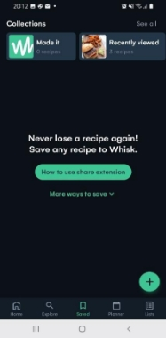

- Planificación semanal (planner) y Lista de compras (list)

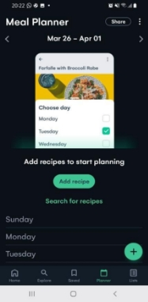 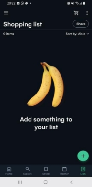

- Sección “comunidad”, “agregar amigos” y “mi perfil”   ![ref1]![ref2]![ref10]![ref8]![ref9]

14  

Morán, Portan, Quesada, Roque  

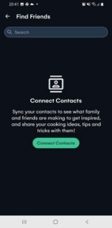 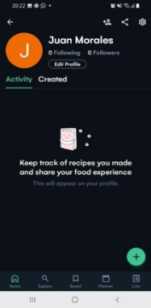

Por último la tercera aplicación que hemos decidido mostrar es “Tasty”, esta aplicación cuenta con diferentes secciones, entre estas están: Discover, Community, My bag y Profile. En  cada  una  podemos  encontrar  diferentes  interacciones  como  por  ejemplo:  dentro  de “Discover” encontramos una amplia cantidad de platillos a los cuales nosotros podemos acceder para una mayor información, dentro de “Community” encontramos recetas hechas por otros usuarios que desean poder compartirlas con las demás personas, en “My bag” podemos realizar nuestra lista de compras con ayuda de Walmart ya que ambos trabajan en conjunto  y  por  último  la  sección  de  “Profile”  en  donde  encontraremos  toda  nuestra información general. 

Tasty fue publicada el 14 de agosto del 2018 ofrecida al público por BuzzFeed, esta aplicación requiere de una versión de Android  7.0 y versiones posteriores. Actualmente la aplicación 

se encuentra en su versión 1.75.0, cuenta con más de 10 millones de descargas y su última actualización fue el 27 de marzo de 2023. 

A continuación mostraremos algunas capturas de pantalla de esta aplicación: 

- Pantalla principal (discover) y profile (login).  ![ref8]

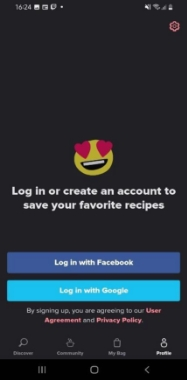

- Sección “Comunity” y “My bag” 

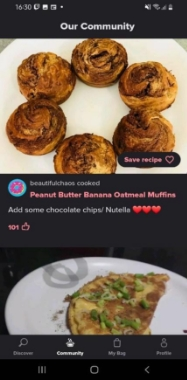 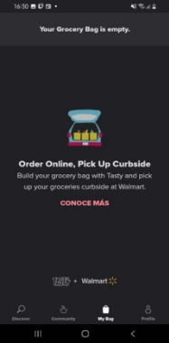 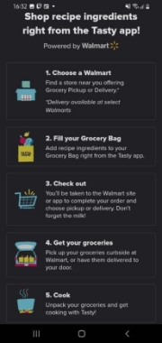

18  ![ref1]![ref2]![ref10]![ref9]

Morán, Portan, Quesada, Roque  
![ref11]

Modelo de Negocio ![ref5]![ref6]![ref7]![ref4]

**Propuesta de Valor:** 

La aplicación ayuda a los usuarios a encontrar rápida y fácilmente recetas que pueden preparar con los ingredientes que tienen a mano, al mismo tiempo que brinda información clave relacionada con la salud sobre cada receta. Al hacerlo, la aplicación les ahorra a los usuarios tiempo y esfuerzo en la planificación de comidas y su dieta, al mismo tiempo promueve hábitos alimenticios saludables.

En general, la aplicación ofrece una solución simple, conveniente y orientada a la salud ante las inconveniencias relacionadas a la planificación de comidas y comprar alimentos. Al abordar estos puntos, la aplicación ofrece un valor real a los usuarios y puede ayudar a generar usuarios leales con el tiempo.

**Segmentos de Clientes:** 

La aplicación tiene como objetivo atraer a las personas preocupadas por su salud que están interesadas en cocinar y quieren hacer uso de los ingredientes que tienen a mano, y al mismo tiempo mantener una dieta equilibrada y saludable. Estos son algunos mercados objetivo potenciales para la aplicación:

**Entusiastas de la salud:**  

Personas que se enfocan en mantener un estilo de vida saludable y buscan formas nuevas y creativas de incorporar alimentos nutritivos en sus dietas.

Este segmento del mercado podría ser receptivo a las características de la aplicación relacionadas con la salud, dado que se encuentra interesado en explorar nuevas y creativas formas de incorporar alimentos nutritivos en sus dietas. Este mercado también tiene un gran potencial de crecimiento, contando con una amplia gama de usuarios potenciales para aprovechar.

**Profesionales ocupados:**  

Personas que tienen horarios ocupados y tiempo limitado para planificar las comidas, pero que aún desean comer de manera saludable y hacer uso de los ingredientes que tienen a mano.

Es probable que este mercado aprecie la conveniencia y los beneficios que ofrece la aplicación, ya que puede ahorrarles tiempo en la planificación de comidas y en la compra de ingredientes. Este mercado también cuenta con un importante potencial de crecimiento, dado que cada vez más personas tienen estilos de vida muy ![ref8]ocupados y buscan soluciones que simplifiquen sus rutinas diarias.![ref1]![ref2]

En general, estos dos mercados son los objetivos principales, por lo que se desarrollará una estrategia![ref9] de marketing que destaque los beneficios de la aplicación que sean más 

![ref4]

relevantes para estos grupos. Asimismo, se desarrollarán funciones que se adapten a sus ![ref5]![ref6]![ref7]necesidades y preferencias.

**Canales de Distribución:**  

El principal canal de distribución a utilizar para la aplicación será Google Play Store. Es la aplicación oficial para dispositivos Android y al distribuir la aplicación por Google Play Store se alcanzará una audiencia muy grande de usuarios de Android.

Para distribuir la aplicación por medio de Google Play Store, se necesita una cuenta de Google Play Developer, el pago para registrarse de $25 y la aceptación del Google Play Store Distribution Agreement.  

Antes de que la aplicación pueda ser mostrada en la Google Play Store, pasará por un proceso de revisión para asegurarse que la aplicación sigue las directrices y directivas de Google Play Store. Una vez la aplicación sea aprobada, esta aparecerá disponible para descargas. 

**Fuentes de Ingresos:** 

En la aplicación se planea utilizar un modelo “*freemium*”. La aplicación se podrá utilizar gratuitamente, pero ciertas características y servicios estarán disponibles solamente a usuarios premium. Un usuario podrá obtener el estatus “*Premium*”, por un costo adicional único. Usuarios normales que utilicen la aplicación también serán sometidos a anuncios publicitarios dentro de la aplicación. Con esto se podrá recolectar ingresos al cobrar a los anunciantes por impresiones o clics.

**Recursos Clave:** 

Los recursos clave requeridos para el desarrollo y operación de la aplicación incluye:

- **Recursos Humanos:** El equipo para la aplicación consiste en 4 estudiantes de Ingeniería Informática. El diseño UI de la aplicación, el proceso de desarrollo, y la coordinación del proyecto se llevará a cabo por los cuatro estudiantes de una manera equitativa.** 
- **Recursos tecnológicos:** En términos de recursos tecnológicos, la aplicación será desarrollada en el lenguaje de programación Kotlin para dispositivos Android. La aplicación utilizará distintas librerías y frameworks como Google Analytics, etc.** 
- **Recursos Financieros:** En términos de fondos financieros la aplicación requerirá una ![ref8]inversión inicial de $25 para cubrir los gastos que conlleva la creación de la cuenta ![ref1]![ref2]de la Google Play Store.  **![ref9]**

En la aplicación se planean utilizar distintos servicios para complementar su  funcionamiento.   ![ref10]

![ref4]

- **Google Cloud Platform (GCP):** El servicio brinda acceso a la nube para que la ![ref5]![ref6]![ref7]aplicación pueda almacenar y procesar datos.
- **Google Analytics**: Permite que las aplicaciones realicen un seguimiento del comportamiento del usuario. Este servicio brinda información sobre la participación y retención de usuarios.
- **OneSignal**: Es un servicio de notificaciones automáticas que permite a los desarrolladores de aplicaciones y propietarios de sitios web enviar notificaciones automáticas específicas y personalizadas a sus usuarios. Con OneSignal, se puede enviar notificaciones a los usuarios en sus dispositivos móviles incluso si no están usando la aplicación. 
- **Servicios de redes sociales (Social Login):** Redes sociales como Facebook, Google, y Twitter proveen APIs que permiten a usuarios ingresar a aplicaciones utilizando sus credenciales de redes sociales. Esto simplificará el proceso de login.

Requerimientos del sistema. 

**Requerimientos funcionales**: 

- La aplicación debe permitir la búsqueda de recetas por medio del nombre de la receta, ingredientes, tipo de cocina, país de origen y demás categorías.
- La aplicación debe permitir que los usuarios guarden recetas en sus cuentas.
- Los usuarios pueden compartir las recetas a través de otras aplicaciones.
- Se puede agregar recetas a el calendario de Google calendar con la cuenta de Google asociada. 
- La aplicación debe permitir agregar a una lista los ingredientes que el usuario posee o desea que las recetas posean, de esta forma funcionar como un filtro para facilitar la búsqueda de recetas que se adapten a lo que el usuario posea. 
- El usuario puede solicitar a través de un formulario agregar una receta propia a la aplicación después de una revisión de los moderadores. 
- Los usuarios de paga podrán tener acceso a mejores recetas conocidas como “VIP”, además que tendrán la opción de mas espacio para guardar recetas en su cuenta.

**Requerimientos no funcionales:  ![ref1]![ref2]![ref8]![ref9]**

- **Seguridad y privacidad**: La aplicación debe garantizar que los datos de los usuarios no se vean comprometidos y garantizar la seguridad de estos.![ref10]

21  ![ref10]

Morán, Portan, Quesada, Roque  
![ref11]

![ref4]

- **Integración**: La aplicación debe de integrarse con plataformas de terceros ![ref5]![ref6]![ref7]como Google calendar y redes sociales, para mejorar la experiencia de usuarios. 
- **Usabilidad**: La aplicación debe ser fácil de usar y navegar para los usuarios.
- **Interfaz de usuario atractiva:** La aplicación debe tener una interfaz de usuario visualmente atractiva y moderna.
- **Velocidad:** La aplicación debe ser rápida y responsiva para evitar la frustración de los usuarios.
- **Disponibilidad:** Permitir el acceso a la aplicación desde múltiples 

plataformas, como iOS y Android, para mejorar la disponibilidad de la misma. 

Diseño y pantallas

**Paleta de colores.** 

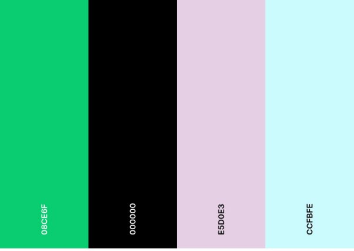

La paleta de la aplicación se eligió pensando en el diseño de la aplicación como amigable ![ref1]![ref2]![ref10]![ref8]![ref9]

pero elegante, juntando colores como el esmeralda que se asemeja al verde de la natural eza 

22 

Morán, Portan, Quesada, Roque 
![ref11]

![ref4]

con otros colores neutros como es el negro y la verde menta, que hacen que  la aplicación ![ref5]![ref6]![ref7]tenga un aspecto más sofisticado. 

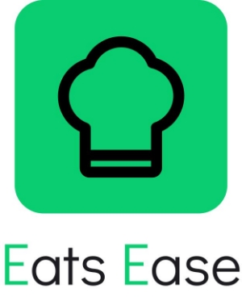

**Logo**. 

**Variantes del logo** 

 

Para el logotipo se decidió trabajar en un imagotipo que permita usar el icono o el texto de ![ref1]![ref2]![ref8]![ref9]diferentes maneras. Manteniendo un estilo minimalista para que sea mejor recordado y no este saturado de contenido.

23  ![ref10]

Morán, Portan, Quesada, Roque  

**Diseño de pantallas de la aplicación. ![ref5]**

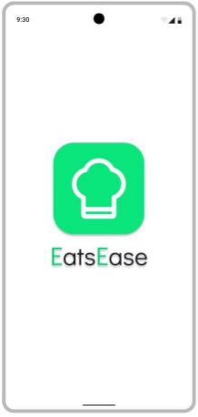

Splashscreen. Es la pantalla que posee el logo de la aplicación que se muestra mientras la aplicación se inicia. 

24  ![ref1]![ref2]![ref10]![ref8]![ref9]

Morán, Portan, Quesada, Roque  

![ref12]

Pantalla de inicio de sesión. Si es la primera vez que se usa la aplicación o no tiene una sesión iniciada aparece esta pantalla que permite iniciar sesión con contraseña, a través de la cuenta de Google, también permite solicitar cambiar la contraseña o en otro caso crear una cuenta para la aplicación** 

![ref12]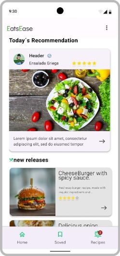

Inicio. Es la pantalla principal de la aplicación, en ella encontraremos la información  más relevante como las recetas recomendadas del día, asi como recetas nuevas entre otras. Desde esta pantalla se puede acceder a dichas recetas, como también a la sección de configuración de la aplicación.

![ref12]

Galería de recetas. En esta pantalla se podrá buscar todas las recetas que existen en la aplicación, se podrá filtrar a través de varias categorías como por ejemplo comida vegana, o 

por países si se requiere, además de poder buscar por palabras, como el nombre de la receta. Existe un botón para poder agregar los ingredientes con los que cuenta el usuario de esta manera poder presentar todas las recetas que se adapten más a los ingredientes del usuario. 

![ref12]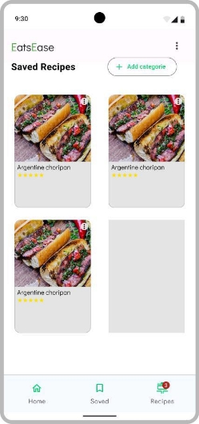

Guardados. En esta pantalla se podrá visualizar todas las recetas que los usuarios guarden al darle al botón de favoritos (corazón), en esta pantalla podrán eliminar las recetas guardadas si lo desean y también agregar categorías de guardado, en las que podas clasificar sus recetas guardadas según ellos consideren.

 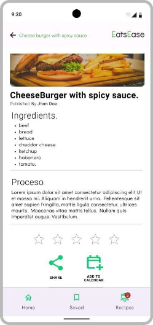

Vista de receta. En esta pantalla se puede leer toda la información de una receta, desde sus ingredientes, el proceso de realización hasta su tiempo de preparación y mucha información más. Se puede agregar la receta a favoritas, compartir con otras aplicaciones y hasta agregar la receta a el calendario en Google calendar.

Design Link:[ https://www.figma.com/file/N1IGG1azAx178HLEYVfaUi/App-Design?node - id=0%3A1&t=NIeW89brFcZBDDjF-1 ](https://www.figma.com/file/N1IGG1azAx178HLEYVfaUi/App-Design?node-id=0%3A1&t=NIeW89brFcZBDDjF-1)

Prototype Link: [https://www.figma.com/proto/N1IGG1azAx178HLEYVfaUi/App-Design?node-id=9- 525&scaling=scale-down&page-id=0%3A1&starting-point-node-id=9%3A968 ](https://www.figma.com/proto/N1IGG1azAx178HLEYVfaUi/App-Design?node-id=9-525&scaling=scale-down&page-id=0%3A1&starting-point-node-id=9%3A968)

Figma file link: [https://drive.google.com/file/d/1R04UVMwwIKHRh2Vs2qBg7oB3Q-zxwpJl/view?usp=sharing ](https://drive.google.com/file/d/1R04UVMwwIKHRh2Vs2qBg7oB3Q-zxwpJl/view?usp=sharing)(Es muy pesado para subirlo al Moodle) 

30  ![ref1]![ref2]![ref10]![ref8]![ref9]

Morán, Portan, Quesada, Roque  
![ref3]

**Diagrama de flujo de UX ![ref5]![ref6]**

    

Figma Link:[ https://www.figma.com/file/qADHmxwvTDPDQyrVkzaP5u/Untitled?node- id=0%3A1&t=XeXRk4NHNJaLI5UC-1 ](https://www.figma.com/file/qADHmxwvTDPDQyrVkzaP5u/Untitled?node-id=0%3A1&t=XeXRk4NHNJaLI5UC-1)
33  ![ref1]![ref2]![ref10]![ref8]![ref9]

Morán, Portan, Quesada, Roque  

[ref1]: Aspose.Words.90692fa2-4a9e-4288-ade4-3b16383ce56d.002.png
[ref2]: Aspose.Words.90692fa2-4a9e-4288-ade4-3b16383ce56d.003.png
[ref3]: Aspose.Words.90692fa2-4a9e-4288-ade4-3b16383ce56d.007.png
[ref4]: Aspose.Words.90692fa2-4a9e-4288-ade4-3b16383ce56d.008.png
[ref5]: Aspose.Words.90692fa2-4a9e-4288-ade4-3b16383ce56d.009.png
[ref6]: Aspose.Words.90692fa2-4a9e-4288-ade4-3b16383ce56d.010.png
[ref7]: Aspose.Words.90692fa2-4a9e-4288-ade4-3b16383ce56d.011.png
[ref8]: Aspose.Words.90692fa2-4a9e-4288-ade4-3b16383ce56d.012.png
[ref9]: Aspose.Words.90692fa2-4a9e-4288-ade4-3b16383ce56d.006.png
[ref10]: Aspose.Words.90692fa2-4a9e-4288-ade4-3b16383ce56d.005.png
[ref11]: Aspose.Words.90692fa2-4a9e-4288-ade4-3b16383ce56d.021.png
[ref12]: Aspose.Words.90692fa2-4a9e-4288-ade4-3b16383ce56d.061.png
