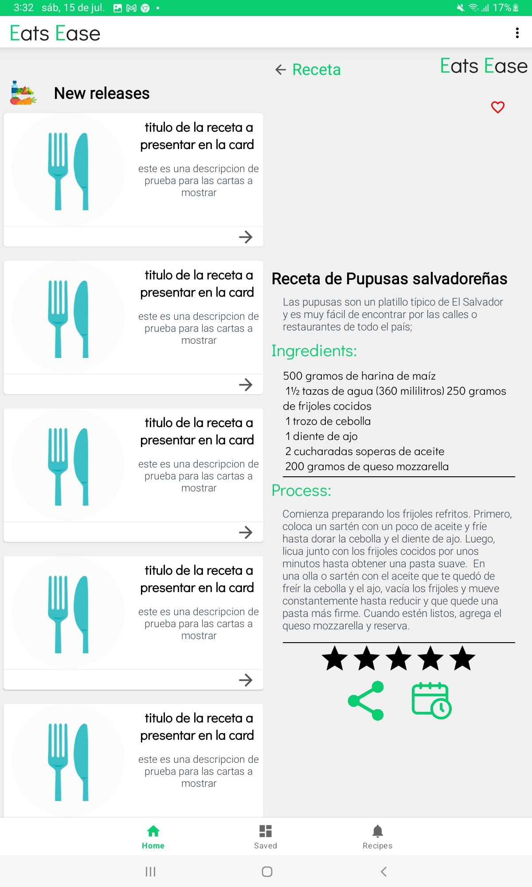
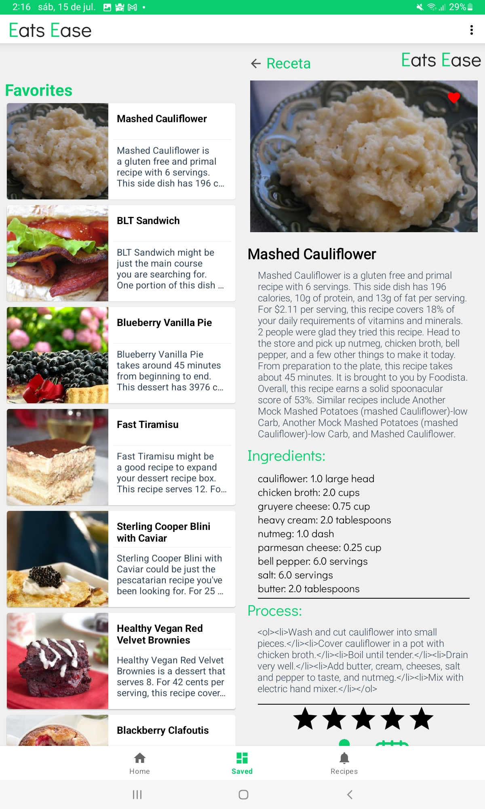
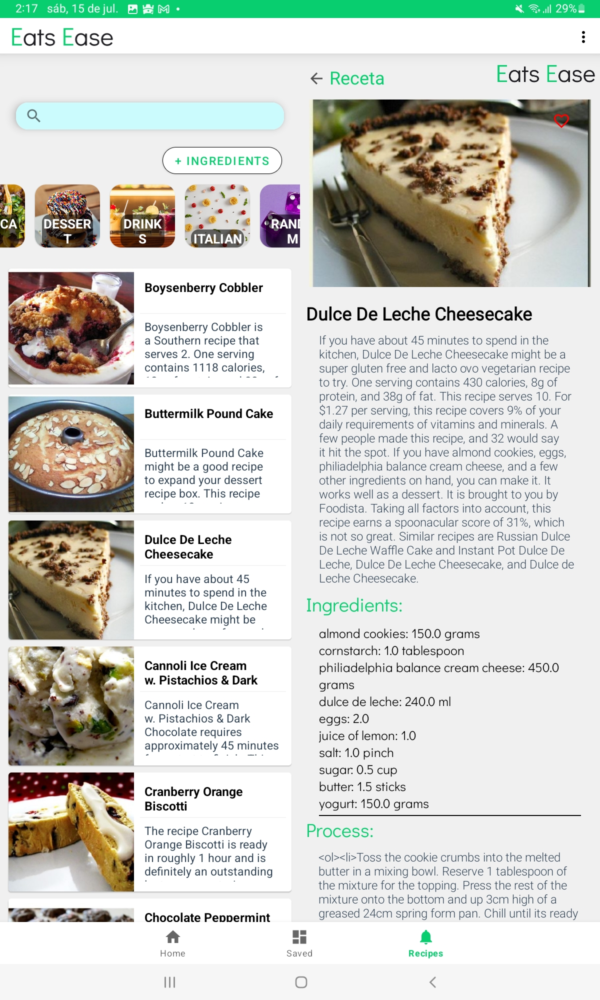
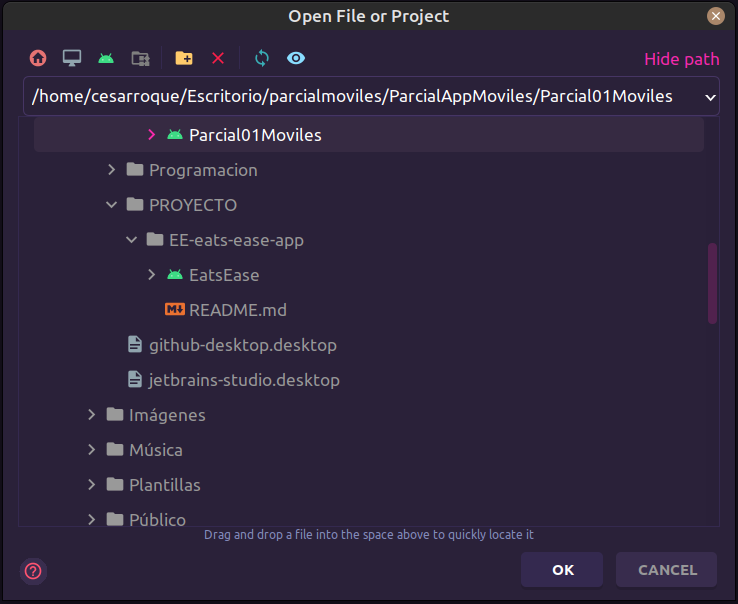
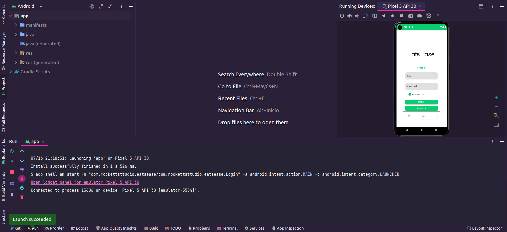
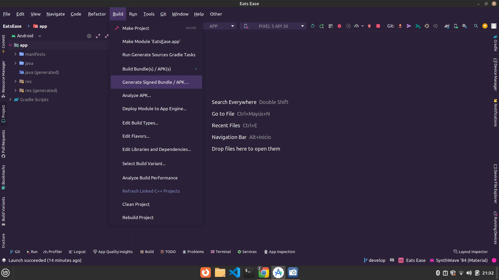
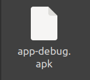

**UNIVERSIDAD CENTROAMERICANA JOSÉ SIMEÓN CAÑAS**

{width="1.7916666666666667in"
height="2.3958333333333335in"}

> **Programación**\
> **de**\
> **Dispositivos Móviles**
>
> **Documentación de Proyecto:**\
> **Eat Ease**
>
> **Integrantes:**\
> Moran Rivas, Xavier Fabricio 00106121\
> Portan Rivas, Jaime Samuel 00046119\
> Quesada Cortez, Daniel Alfredo 00147619\
> Roque Castro, Cesar Antonio 00015319
>
> **lunes, 17 de julio de 2023**\
> **[Eats Ease]{.underline}**
>
> Introducción
>
> Eats Ease: La forma más fácil de descubrir y disfrutar deliciosas
> recetas en un solo lugar. Desarrollada por el equipo RocketStudio, es
> una aplicación que te brinda acceso a una amplia variedad de recetas
> culinarias, organizadas de manera intuitiva en tres secciones
> principales: Home, Saved y Recipes.
>
> En la sección Home, encontrarás la pantalla principal donde podrás
> explorar las últimas tendencias en gastronomía y descubrir nuevas
> ideas para tus comidas diarias. La sección Saved te permite guardar
> tus recetas favoritas para acceder a ellas rápidamente en cualquier
> momento.
>
> Pero eso no es todo. En la sección Recipes, tendrás acceso a una
> amplia lista de tipos de comida, cada uno con sus propias y deliciosas
> recetas. Podrás explorar las recetas una a una, visualizando imágenes
> apetitosas, nombres, descripciones completas, ingredientes necesarios
> y los pasos detallados para preparar cada plato.
>
> Además, Eats Ease te ofrece la posibilidad de calificar las recetas
> mediante un sistema de rating de estrellas, compartir tus recetas
> favoritas con amigos y familiares, y también agregarlas al calendario
> para planificar tus comidas con anticipación.

+-----------------+-----------------+-----------------+-----------------+
| La              | aplicación      | también         | > cuenta con    |
|                 |                 |                 | > una sección   |
|                 |                 |                 | > de Settings,  |
|                 |                 |                 | > donde podrás  |
+=================+=================+=================+=================+
+-----------------+-----------------+-----------------+-----------------+

> personalizar tu experiencia. Puedes gestionar tu cuenta, garantizar la
> seguridad de tus datos, ajustar la configuración de la aplicación de
> acuerdo a tus preferencias, acceder al centro de ayuda y, si lo
> deseas, cerrar sesión.
>
> Descubre la cocina de una manera más sencilla y deliciosa con Eats
> Ease. ¡Deja que tus papilas gustativas se emocionen mientras exploras
> un mundo de sabores y creatividad culinaria en la palma de tu mano!

Morán, Portan, Quesada, Roque

> **Requisitos del sistema**
>
> ● Versión mínima de Android: API 24: Android 7.0 (Nougat)\
> ● Resolución de pantalla recomendada mínima: 1280 (alto) 720 (ancho)
> píxeles o superior.
>
> ● Conexión a Internet: SE NECESITA una conexión estable para cargar
> contenido y acceder a las últimas recetas.
>
> ● Espacio de almacenamiento: Se requiere al menos 100 MB de espacio
> disponible en el dispositivo para instalar la aplicación.
>
> ● Memoria RAM: Se recomienda un dispositivo con al menos 2 GB de
> memoria RAM para un rendimiento óptimo.
>
> ● Permisos: La aplicación requiere permisos de acceso al calendario,
> acceso a internet, para poder agregar la receta al día que deseamos.

Morán, Portan, Quesada, Roque

> **Configuración del entorno de desarrollo**
>
> Descarga e instalación de Android Studio:

<table style="width:100%;">
<colgroup>
<col style="width: 10%" />
<col style="width: 10%" />
<col style="width: 10%" />
<col style="width: 10%" />
<col style="width: 10%" />
<col style="width: 10%" />
<col style="width: 10%" />
<col style="width: 10%" />
<col style="width: 10%" />
<col style="width: 10%" />
</colgroup>
<thead>
<tr class="header">
<th>●</th>
<th><blockquote>

Ve

</blockquote></th>
<th>al</th>
<th>sitio</th>
<th>web</th>
<th>oficial</th>
<th>de</th>
<th>Android</th>
<th>Studio</th>
<th><blockquote>

en

</blockquote></th>
</tr>
</thead>
<tbody>
</tbody>
</table>

> .
>
> ● Haz clic en el botón \"Descargar Android Studio\" y sigue las
> instrucciones de instalación para tu sistema operativo.
>
> ● Una vez instalado, ejecuta Android Studio y sigue los pasos de
> configuración inicial.
>
> Configuración del SDK de Android:\
> ● Abre Android Studio y ve al menú \"File\" \> \"Settings\" en
> Windows/Linux o \"Android Studio\" \> \"Preferences\" en macOS.
>
> ● En la ventana de configuración, selecciona \"Appearance & Behavior\"
> (Apariencia y comportamiento) y luego \"System Settings\"
> (Configuración del sistema).
>
> ● Haz clic en \"Android SDK\" y asegúrate de que al menos una versión
> del SDK de Android esté instalada. Si no, haz clic en \"Edit\"
> (Editar) y selecciona la versión deseada para instalarla.
>
> Configuración del emulador de Android o dispositivo físico:\
> ● Para utilizar el emulador de Android, ve al menú \"Tools\"
> (Herramientas) \> \"AVD Manager\" (Administrador de AVD) y crea un
> nuevo dispositivo virtual. ● Si prefieres utilizar un dispositivo
> físico, conecta tu dispositivo al ordenador a través de un cable USB y
> asegúrate de que la depuración USB esté habilitada en la configuración
> de desarrollo de tu dispositivo.
>
> Creación del proyecto Eats Ease:\
> ● Abre Android Studio: Una vez instalado Android Studio, ábrelo desde
> el menú de inicio o desde el acceso directo en tu escritorio.
>
> ● Selecciona \"Create New Project\": En la pantalla de bienvenida de
> Android Studio, selecciona \"Create New Project\" para comenzar el
> asistente de creación.
>
> ● Completa la configuración del proyecto: Elegimos el nombre para
> nuestro proyecto, el package name, la ubicación los dejamos como
> están, el lenguaje utilizamos kotlin y por último nuestra versión
> ocuparemos Android 7.0 (Nougat)\
> ● Elige la plantilla de actividad: Selecciona la plantilla de
> actividad que mejor se adapte a tu aplicación. Por ejemplo, puedes
> elegir \"Empty Activity\" (Actividad vacía) para comenzar con una
> actividad en blanco.
>
> ● Haz clic en \"Finish\": Una vez que hayas revisado y configurado
> todas las opciones, haz clic en \"Finish\" para que Android Studio
> genere el proyecto.

Morán, Portan, Quesada, Roque

> **Arquitectura del proyecto**
>
> El proyecto Eats Ease sigue una arquitectura basada en el patrón
>
> Modelo-Vista-ViewModel (MVVM) para lograr una separación clara de
>
> responsabilidades y un desarrollo modular. A continuación, se detallan
> los
>
> componentes principales de la arquitectura:
>
> **●** **Modelo (Model):**
>
> El modelo se encarga de representar los datos de la aplicación, como
> las
>
> recetas, los ingredientes y la información de configuración.
>
> Se implementan clases y estructuras de datos para gestionar la
> manipulación
>
> y el acceso a los datos, ya sea mediante servicios web, bases de datos
>
> locales u otras fuentes.
>
> **●** **Vista (View):**
>
> La vista se refiere a la interfaz de usuario con la que los usuarios
> interactúan.
>
> Se implementan actividades (Activities) y fragmentos (Fragments) para
>
> mostrar las diferentes pantallas de la aplicación, como la pantalla
> principal

(Home), la lista de recetas (Recipes) y la pantalla de detalles de
receta.

> La vista se encarga de mostrar los datos al usuario y capturar las
>
> interacciones del usuario, como toques y desplazamientos.
>
> **●** **ViewModel:**
>
> El ViewModel actúa como un intermediario entre la vista y el modelo.
>
> Se encarga de proporcionar los datos necesarios a la vista y gestionar
> la
>
> lógica de presentación.
>
> Comunica cambios en los datos del modelo a la vista y procesa las

<table style="width:100%;">
<colgroup>
<col style="width: 10%" />
<col style="width: 10%" />
<col style="width: 10%" />
<col style="width: 10%" />
<col style="width: 10%" />
<col style="width: 10%" />
<col style="width: 10%" />
<col style="width: 10%" />
<col style="width: 10%" />
<col style="width: 10%" />
</colgroup>
<thead>
<tr class="header">
<th>interacciones</th>
<th>del</th>
<th>usuario</th>
<th>para</th>
<th>actualizar</th>
<th>los</th>
<th>datos</th>
<th>del</th>
<th>modelo</th>
<th><blockquote>

en

</blockquote></th>
</tr>
</thead>
<tbody>
</tbody>
</table>

> consecuencia.

Además de estos componentes principales, el proyecto Eats Ease también
hace uso

de otras prácticas de desarrollo recomendadas, como la inyección de
dependencias

> para facilitar la gestión de dependencias y promover la modularidad
> del código.

<table>
<colgroup>
<col style="width: 9%" />
<col style="width: 9%" />
<col style="width: 9%" />
<col style="width: 9%" />
<col style="width: 9%" />
<col style="width: 9%" />
<col style="width: 9%" />
<col style="width: 9%" />
<col style="width: 9%" />
<col style="width: 9%" />
<col style="width: 9%" />
</colgroup>
<thead>
<tr class="header">
<th>La</th>
<th>arquitectura</th>
<th>MVVM</th>
<th>utilizada</th>
<th>en</th>
<th>el</th>
<th>proyecto</th>
<th>Eats</th>
<th>Ease</th>
<th>permite</th>
<th><blockquote>

una

</blockquote></th>
</tr>
</thead>
<tbody>
</tbody>
</table>

> implementación limpia, fácil mantenimiento y pruebas efectivas.

Morán, Portan, Quesada, Roque

> **Arquitectura de Base de datos**
>
> En EatsEase, utilizamos Firebase Realtime Database para almacenar las
> recetas de comida favoritas de los usuarios. La base de datos está
> organizada de la siguiente manera:

+--------+--------+--------+--------+--------+--------+--------+--------+
| ●      | **u    | (**c   | Esta   | col    | co     | infor  | >      |
|        | sers** | olecci |        | ección | ntiene | mación |  sobre |
|        |        | ón**): |        |        |        |        | > cada |
|        |        |        |        |        |        |        | > u    |
|        |        |        |        |        |        |        | suario |
+========+========+========+========+========+========+========+========+
+--------+--------+--------+--------+--------+--------+--------+--------+

> registrado en la aplicación.
>
> ○ **\<user id\> (documento)**: Cada documento representa un usuario
> individual y está identificado por un ID único asignado por Firebase.
>
> ■ **favorites (colección)**: Esta colección almacena las recetas
> favoritas del usuario.
>
> **\<recipe id\> (documento)**: Cada documento en esta colección●\
> representa una receta favorita y se identifica mediante un ID único
> asignado por Firebase.
>
> ○ **imgUrl (campo)**: Almacena la URL de la imagen de la\
> receta favorita.

+---------+---------+---------+---------+---------+---------+---------+
| ○       | **recip | **(ca   | C       | la      | lista   | > de    |
|         | eIngred | mpo)**: | ontiene |         |         |         |
|         | ients** |         |         |         |         |         |
+=========+=========+=========+=========+=========+=========+=========+
+---------+---------+---------+---------+---------+---------+---------+

ingredientes necesarios para preparar la receta.

> ○ **recipeInstructions (campo)**: Guarda las instrucciones\
> paso a paso para cocinar la receta.

+-----------+-----------+-----------+-----------+-----------+-----------+
| ○         | **recipe  | **(       | Almacena  | un        | > breve   |
|           | Summary** | campo)**: |           |           |           |
+===========+===========+===========+===========+===========+===========+
+-----------+-----------+-----------+-----------+-----------+-----------+

resumen o descripción de la receta.

> ○ **recipeTitle (campo)**: Contiene el título o nombre de la\
> receta.
>
> ○ **sourceURL (campo)**: Guarda la URL de la fuente\
> original de la receta.
>
> Con esta estructura, podemos acceder eficientemente a las recetas
> favoritas de cada usuario y obtener información relevante de cada
> receta, como la imagen, los ingredientes y las instrucciones de
> preparación. Firebase Realtime Database es una base de datos NoSQL
> basada en documentos, lo que nos permite almacenar datos en forma de
> árbol jerárquico y recuperarlos en tiempo real.
>
> En EatsEase también utilizamos una base de datos MySQL conectada a
> través de una API para permitir a los usuarios guardar sus propias
> recetas. La base de datos está diseñada con las siguientes tablas y
> campos:
>
> Tabla \"users\"\
> ● Id: Identificador único del usuario (clave primaria).
>
> ● username: Nombre de usuario del usuario.
>
> ● email: Correo electrónico del usuario.
>
> password: Contraseña del usuario.●\
> Tabla \"recipes\"\
> ● id: Identificador único de la receta (clave primaria).
>
> ● user_id: ID del usuario que creó la receta (clave foránea que se
> relaciona con la tabla \"users\").
>
> title: Título o nombre de la receta.●\
> ● description: Descripción de la receta.

Morán, Portan, Quesada, Roque

+-----------------------------------+-----------------------------------+
| > ●\                              | > ingredients: Lista de           |
| > ●\                              | > ingredientes necesarios para    |
| > ●                               | > preparar la receta.             |
|                                   | > instructions: Instrucciones     |
|                                   | > paso a paso para cocinar la     |
|                                   | > receta.\                        |
|                                   | > created_at: Fecha y hora en que |
|                                   | > se creó la receta.              |
+===================================+===================================+
+-----------------------------------+-----------------------------------+

> Cada usuario registrado en la aplicación tiene una entrada en la tabla
> \"users\" que contiene su información básica, como nombre de usuario,
> correo electrónico y contraseña. La tabla \"recipes\" almacena las
> recetas creadas por los usuarios. Cada receta tiene un ID único, un ID
> de usuario asociado que indica quién la creó y campos para el título,
> descripción, ingredientes, instrucciones y fecha de creación.
>
> La API se encarga de manejar las solicitudes de los usuarios y ejecuta
> consultas a la base de datos MySQL para almacenar y recuperar la
> información de las recetas.
>
> Esta arquitectura permite a los usuarios guardar y administrar sus
> propias recetas de forma personalizada en la base de datos MySQL
> conectada a través de la API.
>
> **Arquitectura de API's Eats Ease**
>
> La API está construida utilizando el framework Express de Node.js para
> crear un servidor web que escucha en el puerto 3000. Su objetivo
> principal es proporcionar endpoints para obtener y agregar información
> de una tabla de base de datos MySQL llamada \"recipes\".
>
> Configuración de la base de datos:
>
> Se utiliza mysql2 para establecer la conexión con la base de datos
> MySQL que se encuentra en la IP \"143.198.69.35\" y el puerto 3306. Se
> proporcionan las credenciales de acceso para autenticarse en la base
> de datos \"eedatabase\".
>
> Endpoint \"/\" (GET):
>
> Cuando se accede a la raíz de la API (http://**ipdroplet**:3000/),
> devuelve el mensaje \"Welcome to the API\". Este es simplemente un
> mensaje de bienvenida para verificar que la API está en
> funcionamiento.
>
> Endpoint \"/Home\" (GET):
>
> Si se accede a \"/Home\" (http://(http://**ipdroplet**:3000//Home), la
> API responderá enviando el archivo HTML \"index.html\" ubicado en la
> carpeta \"public/Page\". Esta ruta parece ser utilizada para mostrar
> una página de inicio o una interfaz web en el navegador.

Morán, Portan, Quesada, Roque

> Endpoint \"/recipes\" (GET):
>
> Al acceder a \"/recipes\"
> (http://(http://**ipdroplet**:3000//recipes), la API realizará una
> consulta SELECT en la tabla \"recipes\" de la base de datos. Luego,
> enviará los resultados como respuesta en formato JSON, lo que
> permitirá obtener todos los registros de la tabla \"recipes\". Si hay
> algún error en la consulta, se devolverá un mensaje de error con un
> código de estado 500.
>
> Endpoint \"/newRecipe\" (POST):

<table style="width:100%;">
<colgroup>
<col style="width: 10%" />
<col style="width: 10%" />
<col style="width: 10%" />
<col style="width: 10%" />
<col style="width: 10%" />
<col style="width: 10%" />
<col style="width: 10%" />
<col style="width: 10%" />
<col style="width: 10%" />
<col style="width: 10%" />
</colgroup>
<thead>
<tr class="header">
<th>Al</th>
<th>enviar</th>
<th>una</th>
<th>solicitud</th>
<th rowspan="2">la</th>
<th colspan="2"><blockquote>

POST

</blockquote></th>
<th>a</th>
<th colspan="2"><blockquote>

"/newRecipe"

</blockquote></th>
</tr>
<tr class="odd">
<th colspan="4"><blockquote>

(http://(http://<strong>ipdroplet</strong>:3000//newRecipe),

</blockquote></th>
<th>API</th>
<th>espera</th>
<th>recibir</th>
<th>los</th>
<th><blockquote>

siguientes

</blockquote></th>
</tr>
</thead>
<tbody>
</tbody>
</table>

> parámetros en la URL: \"user_id\", \"title\", \"description\",
> \"ingredients\" e \"instructions\". Estos parámetros se utilizan para
> crear un nuevo objeto de receta, que se inserta en la tabla
> \"recipes\" mediante una consulta INSERT. Si la inserción tiene éxito,
> se devuelve un mensaje de éxito en formato JSON. Si ocurre algún error
> durante la inserción, se devolverá un mensaje de error con un código
> de estado 500.
>
> Cierre de la conexión con la base de datos:
>
> Cuando el proceso de Node.js se detiene o se cierra, se maneja el
> evento \"exit\". En este momento, se cierra la conexión con la base de
> datos MySQL.
>
> Esta API proporciona endpoints para obtener todos los registros de la
> tabla \"recipes\" y agregar nuevos registros a través de una solicitud
> POST.

Morán, Portan, Quesada, Roque

> **Funcionalidad del proyecto**
>
> Para la funcionalidad del proyecto hemos decidido mostrar capturas de
> pantalla de las diferentes secciones con las que nuestra aplicación
> cuenta, para así dar a conocer un poco más con respecto a la
> funcionalidades que con las que esta cuenta.

+--------+--------+--------+--------+--------+--------+--------+--------+
| **●**  | **Pant | **de** | **ini  | La     | pa     | pri    | > m    |
|        | alla** |        | cio:** |        | ntalla | ncipal | uestra |
|        |        |        |        |        |        |        | > un   |
|        |        |        |        |        |        |        | > menú |
|        |        |        |        |        |        |        | > con  |
|        |        |        |        |        |        |        | > las  |
+========+========+========+========+========+========+========+========+
+--------+--------+--------+--------+--------+--------+--------+--------+

> características de un login la cual si somos nuevos nos permite
> registrarnos, si ya tenemos una cuenta existente nos permite iniciar
> sesión y por último otra característica con la que cuentas es que nos
> permite registrarnos con nuestra cuenta de google.

+-----------------------+-----------------------+-----------------------+
| > {width="2.0in" | e3.png){width="2.0in" | png){width="2.0625in" |
| > height="3           | height="              | > height="3.875in"}   |
| .8847222222222224in"} | 3.863888888888889in"} |                       |
+=======================+=======================+=======================+
+-----------------------+-----------------------+-----------------------+

> La aplicación cuenta con tres secciones principales: Home, Saved &
> Recipes
>
> **●** **Home:** En esta sección el usuario podrá observar distintas
> recetas las cuales las podremos considerar como recomendaciones que la
> aplicación hace al usuario.

Morán, Portan, Quesada, Roque

{width="2.4902777777777776in"
height="4.176388888888889in"}

> **●** **Saved:** Dentro de esta sección el usuario podrá encontrar
> todas las recetas que él ha decidido marcar como favoritas permitiendo
> así que pueda encontrarlas con facilidad la próxima vez que ingrese.

{width="2.573611111111111in"
height="4.291666666666667in"}

Morán, Portan, Quesada, Roque

+-----------------------------------+-----------------------------------+
| **●**                             | > **Recipes:** En la sección de   |
|                                   | > Recipes el usuario podrá        |
|                                   | > encontrar el catálogo           |
+===================================+===================================+
+-----------------------------------+-----------------------------------+

> completo de los distintos tipos de comida escogiendo el que más le
> guste, una vez realizada esta acción el usuario podrá ver una vista
> detallada mostrando una breve descripción, los ingredientes y el
> proceso de la realización.

{width="2.437498906386702in"
height="4.083333333333333in"}

> La aplicación cuenta con una sección de **"Settings"** donde el
> usuario podrá acceder para así hacer uso de las diferentes funciones
> como por ejemplo: cambiar la contraseña, ver las preguntas frecuentes,
> cerrar sesión, contactar con soporte, etc.

+-----------------------+-----------------------+-----------------------+
| > {width=" | a/image9.png){width=" | /image10.png){width=" |
| 1.9277766841644794in" | 1.9166666666666667in" | 1.9166666666666667in" |
| > height="            | height="              | > height="3           |
| 3.197221128608924in"} | 3.197221128608924in"} | .1763877952755903in"} |
+=======================+=======================+=======================+
+-----------------------+-----------------------+-----------------------+

Morán, Portan, Quesada, Roque

> Eats Ease cuenta con otras funcionalidades como por ejemplo buscar
> recetas de acuerdo a los ingredientes que nosotros ingresemos o
> buscando directamente el nombre del platillo, también nos permite
> compartir las recetas con nuestros amigos y poder agregarlas a nuestro
> calendario para llevar una planificación.

+-----------------------------------+-----------------------------------+
| > {width="2.187498906386702in" | .png){width="2.198610017497813in" |
| > height="3.6458333333333335in"}  | > height="3.6666666666666665in"}  |
| >                                 | >                                 |
| > {width="2.1569444444444446in" | png){width="2.1555544619422573in" |
| > height="3.6041655730533684in"}  | > height="3.6138877952755903in"}  |
+===================================+===================================+
+-----------------------------------+-----------------------------------+

Morán, Portan, Quesada, Roque

> **Librerías y dependencias**
>
> Repositorios utilizados:
>
> ● **google():** Este repositorio es proporcionado por Google y está
> incluido de forma predeterminada en los proyectos de Android en
> Android Studio. El repositorio "google()" proporciona acceso a las
> librerías y dependencias desarrolladas y mantenidas por Google. Aquí
> se encuentran librerías y componentes esenciales como el SDK de
> Android, bibliotecas tanto de diseño y mantenimiento.
>
> ● **mavenCentral():** Este repositorio es uno de los repositorios más
> utilizados y populares en el ecosistema de Java y Android. Maven
> Central es un repositorio público que alberga una amplia gama de
> librerías y dependencias de código abierto desarrolladas por la
> comunidad de desarrolladores.
>
> Dependencias utilizadas:
>
> 1\. androidx.core:core-ktx:1.10.1
>
> Esta es una biblioteca de Kotlin para AndroidX que proporciona
> extensiones y funciones de utilidad para trabajar con el marco de
> AndroidX. Ayuda a escribir código más conciso y legible al agregar
> funciones útiles para trabajar con Contextos, Vistas y otras clases
> básicas de Android.
>
> 2\. com.google.android.material:material:1.9.0
>
> Esta biblioteca contiene componentes de Material Design, como botones,
> tarjetas, barras de herramientas y más. Material Design es una guía de
> diseño de Google que ayuda a mantener una apariencia y experiencia de
> usuario coherente en las aplicaciones de Android.
>
> 3\. androidx.lifecycle:lifecycle-livedata-ktx:2.6.1
>
> Esta biblioteca proporciona extensiones de Kotlin para LiveData, lo
> que facilita la observación y actualización de datos reactivos en la
> interfaz de usuario. LiveData es una clase observable que se puede
> utilizar para transmitir cambios de datos desde la capa de repositorio
> a la capa de presentación.

Morán, Portan, Quesada, Roque

> 4\. androidx.lifecycle:lifecycle-viewmodel-ktx:2.6.1
>
> Esta biblioteca proporciona extensiones de Kotlin para ViewModel, lo
> que facilita la creación y obtención de instancias de ViewModel.
> ViewModel se utiliza para almacenar y administrar datos relacionados
> con la interfaz de usuario de una manera que sobrevive a los cambios
> de configuración.
>
> 5\. androidx.navigation:navigation-fragment-ktx:2.6.0
>
> Esta biblioteca proporciona extensiones de Kotlin para trabajar con el
> componente Navigation en Android. El componente Navigation ayuda a
> implementar la navegación entre diferentes destinos (pantallas o
> fragmentos) de manera más sencilla y estructurada.
>
> 6\. androidx.navigation:navigation-ui-ktx:2.6.0
>
> Esta biblioteca proporciona extensiones de Kotlin para trabajar con
> las interfaces de usuario relacionadas con el componente Navigation.
> Facilita la vinculación de elementos de la interfaz de usuario (como
> botones) con acciones de navegación.
>
> 7\. com.google.firebase:firebase-auth-ktx:22.0.0
>
> Esta biblioteca contiene extensiones de Kotlin para Firebase
> Authentication. Facilita la autenticación de usuarios utilizando la
> plataforma Firebase de Google.
>
> 8\. com.google.firebase:firebase-auth:22.0.0
>
> Esta biblioteca es la dependencia principal para Firebase
> Authentication. Incluye las clases principales para la autenticación
> de usuarios.
>
> 9\. com.google.firebase:firebase-bom:32.1.1
>
> Esta dependencia se usa como Bill of Materials (BoM) para la
> plataforma Firebase. Simplifica la gestión de versiones al agrupar
> todas las bibliotecas de Firebase bajo una misma versión.

Morán, Portan, Quesada, Roque

> 10.com.google.android.gms:play-services-auth:20.5.0
>
> Esta biblioteca proporciona funciones para interactuar con los
> servicios de autenticación de Google, como el inicio de sesión con
> Google.
>
> 11\. com.google.firebase:firebase-database-ktx:20.2.2
>
> Esta biblioteca contiene extensiones de Kotlin para Firebase Realtime
> Database. Facilita la interacción con la base de datos en tiempo real
> de Firebase.
>
> 12.com.squareup.retrofit2:retrofit:2.9.0
>
> Retrofit es una biblioteca utilizada para realizar solicitudes HTTP de
> manera sencilla en Android. Facilita la comunicación con servicios web
> y la recuperación de datos.
>
> 13.androidx.activity:activity-ktx:\$activity_version
>
> Esta dependencia proporciona extensiones de Kotlin para trabajar con
> actividades de Android. Ayuda a simplificar tareas comunes
> relacionadas con las actividades.
>
> 14.androidx.fragment:fragment-ktx:\$fragment_version

+-------+-------+-------+-------+-------+-------+-------+-------+-------+
| Esta  | bibli | p     | e     | de    | K     | para  | tra   | > con |
|       | oteca | ropor | xtens |       | otlin |       | bajar |       |
|       |       | ciona | iones |       |       |       |       |       |
+=======+=======+=======+=======+=======+=======+=======+=======+=======+
+-------+-------+-------+-------+-------+-------+-------+-------+-------+

> fragmentos en Android. Facilita la creación y administración de
> fragmentos.
>
> 15.com.squareup.retrofit2:converter-gson:2.9.0
>
> Esta dependencia se utiliza para convertir objetos JSON en objetos
> Java utilizando Gson con Retrofit.
>
> 16.com.squareup.okhttp3:logging-interceptor:5.0.0-alpha.11

Morán, Portan, Quesada, Roque

> OkHttp es una biblioteca para realizar solicitudes HTTP y, en este
> caso, el
>
> interceptor de registro se utiliza para registrar las solicitudes y
> respuestas
>
> HTTP para fines de depuración.
>
> 17.androidx.swiperefreshlayout:swiperefreshlayout:1.1.0
>
> Esta biblioteca proporciona la implementación de la interfaz de
> usuario

+--------+--------+--------+--------+--------+--------+--------+--------+
| S      | que    | p      | al     | u      | actu   | el     | > con  |
| wipeRe |        | ermite |        | suario | alizar |        | tenido |
| freshL |        |        |        |        |        |        |        |
| ayout, |        |        |        |        |        |        |        |
+========+========+========+========+========+========+========+========+
+--------+--------+--------+--------+--------+--------+--------+--------+

> deslizando hacia abajo.
>
> 18.com.google.firebase:firebase-database:20.1.0
>
> Esta es otra dependencia de Firebase que proporciona acceso a la base
> de
>
> datos en tiempo real de Firebase.
>
> 19.androidx.fragment:fragment-testing:\$fragment_version
>
> Esta dependencia se utiliza para realizar pruebas de fragmentos en
> Android.
>
> 20.kapt \"androidx.lifecycle:lifecycle-compiler:\$lifecycle_version\"
>
> Esta configuración permite el procesamiento de anotaciones en tiempo
> de
>
> compilación para las bibliotecas de Lifecycle.
>
> 21.com.github.bumptech.glide:glide:4.15.1
>
> Glide es una biblioteca de carga y visualización de imágenes eficiente
> para
>
> Android.
>
> 22.androidx.lifecycle:lifecycle-viewmodel-ktx:\$lifecycle_version
>
> Otra dependencia de Kotlin para la biblioteca de Lifecycle.
> Probablemente
>
> esté siendo usada en conjunto con otras bibliotecas de ViewModel.

Morán, Portan, Quesada, Roque

> 23.org.jetbrains.kotlinx:kotlinx-coroutines-android:1.7.1
>
> Esta biblioteca proporciona extensiones de Kotlin para trabajar con
> coroutines en Android. Las coroutines permiten una programación
> asíncrona más sencilla y concisa.
>
> 24.androidx.paging:paging-runtime:\$paging_version
>
> Esta biblioteca proporciona soporte para la paginación de datos en
> Android. Es útil cuando se necesita cargar grandes conjuntos de datos
> de manera incremental y eficiente, como en listas infinitas o
> paginadas.

Morán, Portan, Quesada, Roque

> **Arquitectura:**

<table style="width:100%;">
<colgroup>
<col style="width: 6%" />
<col style="width: 6%" />
<col style="width: 6%" />
<col style="width: 6%" />
<col style="width: 6%" />
<col style="width: 6%" />
<col style="width: 6%" />
<col style="width: 6%" />
<col style="width: 6%" />
<col style="width: 6%" />
<col style="width: 6%" />
<col style="width: 6%" />
<col style="width: 6%" />
<col style="width: 6%" />
<col style="width: 6%" />
</colgroup>
<thead>
<tr class="header">
<th>El</th>
<th>proyecto</th>
<th>Eats</th>
<th colspan="2">Ease</th>
<th><blockquote>

sigue

</blockquote></th>
<th>una</th>
<th colspan="3">arquitectura</th>
<th><blockquote>

basada

</blockquote></th>
<th>en</th>
<th>el</th>
<th colspan="2"><blockquote>

patrón

</blockquote></th>
</tr>
</thead>
<tbody>
<tr class="odd">
<td colspan="4"><blockquote>

Modelo-Vista-ViewModel

</blockquote></td>
<td colspan="2">(MVVM)</td>
<td colspan="2">combinada</td>
<td><blockquote>

con

</blockquote></td>
<td colspan="2">Android</td>
<td colspan="2">Jetpack,</td>
<td>lo</td>
<td><blockquote>

que

</blockquote></td>
</tr>
</tbody>
</table>

> proporciona una estructura modular, un flujo de datos claro y una
> separación de responsabilidades. A continuación, se detallan las
> principales características de la arquitectura utilizada:
>
> 1\. **Modelo-Vista-ViewModel (MVVM):**\
> ○ La arquitectura MVVM se utiliza para separar la lógica de
> presentación y de negocio de la interfaz de usuario.
>
> ○ El Modelo (Model) representa los datos y la lógica de negocio de la
> aplicación. Incluye clases como entidades, repositorios y fuentes de
> datos.
>
> ○ La Vista (View) representa la interfaz de usuario y se encarga de la
> visualización de los datos. Incluye fragmentos y actividades.
>
> ○ El ViewModel actúa como un intermediario entre el Modelo y la Vista.
>
> Contiene la lógica de presentación y mantiene los datos que la Vista
> necesita para mostrar.
>
> 2\. **Android Jetpack:**\
> ○ El proyecto hace uso extensivo de Android Jetpack, un conjunto de
> bibliotecas y herramientas recomendadas por Google para el desarrollo
> de aplicaciones Android.
>
> ○ Android Jetpack incluye componentes como LiveData, ViewModel,
> Navigation, Room y otras bibliotecas que facilitan el desarrollo y
> mejoran el rendimiento de la aplicación.
>
> 3\. **LiveData y ViewModel:**\
> ○ LiveData se utiliza para implementar la comunicación reactiva entre
> el Modelo y la Vista. Permite que los datos del Modelo sean
> observables y actualiza automáticamente la Vista cuando los datos
> cambian.
>
> ○ ViewModel se encarga de mantener los datos relacionados con la
> interfaz de usuario y sobrevive a los cambios de configuración (como
> rotaciones de pantalla) para evitar la pérdida de datos.
>
> 4\. **Navegación (Navigation):**\
> ○ Se utiliza el componente de navegación de Android Jetpack para
> implementar la navegación entre diferentes pantallas de la aplicación.
> ○ La navegación se define en archivos XML de navegación, lo que
> permite una navegación más coherente y una mejor gestión de los flujos
> de la aplicación.
>
> Esta arquitectura basada en MVVM y Android Jetpack proporciona una
> base sólida para el proyecto Eats Ease, asegurando una estructura
> clara, una gestión eficiente de datos y una interfaz de usuario
> reactiva y actualizada. La combinación de estas tecnologías permite un

Morán, Portan, Quesada, Roque

> **Instrucciones de compilación en android studio**\
> El proyecto se encuentra en la plataforma de github primero los
> clonamos a una carpeta en nuestro escritorio del siguiente\
> \
> Y teniendo clonado el repositorio completo abrimos Android Studio y en
> la parte superior izquierda nos dirigimos a File\>Open\>Open file or
> project.
>
> {width="4.6875in"
> height="3.5319444444444446in"}
>
> Una vez abierto nuestro proyecto y nos cargue completamente todo en la
> barra:
>
> {width="6.270833333333333in"
> height="0.3236111111111111in"}
>
> Como primer paso realizamos la sincronización del gradle del proyecto
> esto sincronizará las dependencias dentro de nuestro proyecto con el
> siguiente botón:

{width="0.4472211286089239in"
height="0.40694444444444444in"}

Morán, Portan, Quesada, Roque

> Como segundo paso elegimos el emulador donde correrá la aplicación en
> nuestro caso el emulador es un PIXEL 5 y le damos play:
>
> {width="5.541666666666667in"
> height="0.44861001749781276in"}
>
> Como paso final nos aparecerá nuestra aplicación corriendo y
> procedemos a registrarnos e interactuar con ella:
>
> {width="6.093055555555556in"
> height="2.875in"}
>
> **Instrucciones de compilación con APK**
>
> Para generar una APK del proyecto procedemos teniendo en cuenta que ya
> hayamos hecho lo primero del caso anterior (clonar repositorio).
>
> Primer paso para generar una apk y poder transferirlo a un teléfono
> móvil o una tablet nos dirigimos a Build\>Generate Signed APK como se
> muestra en la siguiente imagen:
>
> {width="4.718055555555556in"
> height="2.6458333333333335in"}

Morán, Portan, Quesada, Roque

<table>
<colgroup>
<col style="width: 8%" />
<col style="width: 8%" />
<col style="width: 8%" />
<col style="width: 8%" />
<col style="width: 8%" />
<col style="width: 8%" />
<col style="width: 8%" />
<col style="width: 8%" />
<col style="width: 8%" />
<col style="width: 8%" />
<col style="width: 8%" />
<col style="width: 8%" />
</colgroup>
<thead>
<tr class="header">
<th>Una</th>
<th>vez</th>
<th>ya</th>
<th>generada</th>
<th>nuestra</th>
<th>APK</th>
<th>nos</th>
<th>dirigimos</th>
<th>a</th>
<th>descargas</th>
<th>donde</th>
<th><blockquote>

la

</blockquote></th>
</tr>
</thead>
<tbody>
</tbody>
</table>

> encontraremos:

{width="1.5527777777777778in"
height="1.386111111111111in"}

> Con esto ya procedemos a transferirlo a los dispositivos que nosotros
> queramos tener la aplicación y por ende procederemos a la instalación
> siguiendo los pasos que nos de nuestro dispositivo.
>
> **Solución de problemas**:
>
> Aquí mostramos algunos problemas que puedan surgir y su soluciones si
> en dado caso llegan a surgir:
>
> 1\. Error de dependencias faltantes o versión incorrecta:
>
> Verifica que todas las dependencias estén declaradas correctamente en
> el archivo \"build.gradle\" del módulo de aplicación.
>
> Asegurarse de que las versiones de las dependencias sean compatibles
> entre sí. Puedes utilizar la herramienta \"Dependency Insights\" de
> Android Studio para identificar conflictos de versiones y resolverlos.
>
> 2\. Problemas de conexión a Internet para la descarga de dependencias:
>
> Si experimentas problemas para descargar las dependencias durante la
> sincronización del proyecto, verifica tu conexión a Internet y
> asegúrate de que se encuentren actualizadas o verifica que otros
> errores resultan.
>
> 3\. Conflictos de archivos de recursos duplicados:
>
> Si encuentras errores relacionados con archivos de recursos duplicados
> durante la compilación, puedes resolverlos mediante la exclusión de
> archivos duplicados o la configuración de estrategias de resolución de
> conflictos en el

+--------+--------+--------+--------+--------+--------+--------+--------+
| a      | \"bui  | Por    | ej     | puedes | ut     | la     | > dir  |
| rchivo | ld.gra |        | emplo, |        | ilizar |        | ectiva |
|        | dle\". |        |        |        |        |        |        |
+========+========+========+========+========+========+========+========+
+--------+--------+--------+--------+--------+--------+--------+--------+

> \`packagingOptions\` para excluir archivos específicos o utilizar la
> directiva \`resConfigs\` para especificar idiomas específicos a
> incluir.

Morán, Portan, Quesada, Roque

> 4\. Problemas de sincronización del proyecto:\
> Si la sincronización del proyecto no se completa correctamente, puedes
> intentar realizar una \"Invalidación de caché y reinicio\" en Android
> Studio. Ve al menú \"File\" (Archivo) y selecciona \"Invalidate Caches
> / Restart\" (Invalidar cachés / Reiniciar) para reiniciar Android
> Studio y borrar los archivos de caché.
>
> **Referencias**

Morán, Portan, Quesada, Roque
